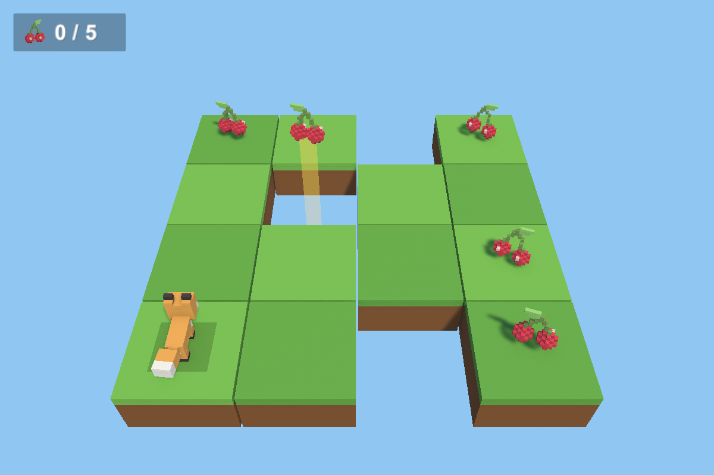
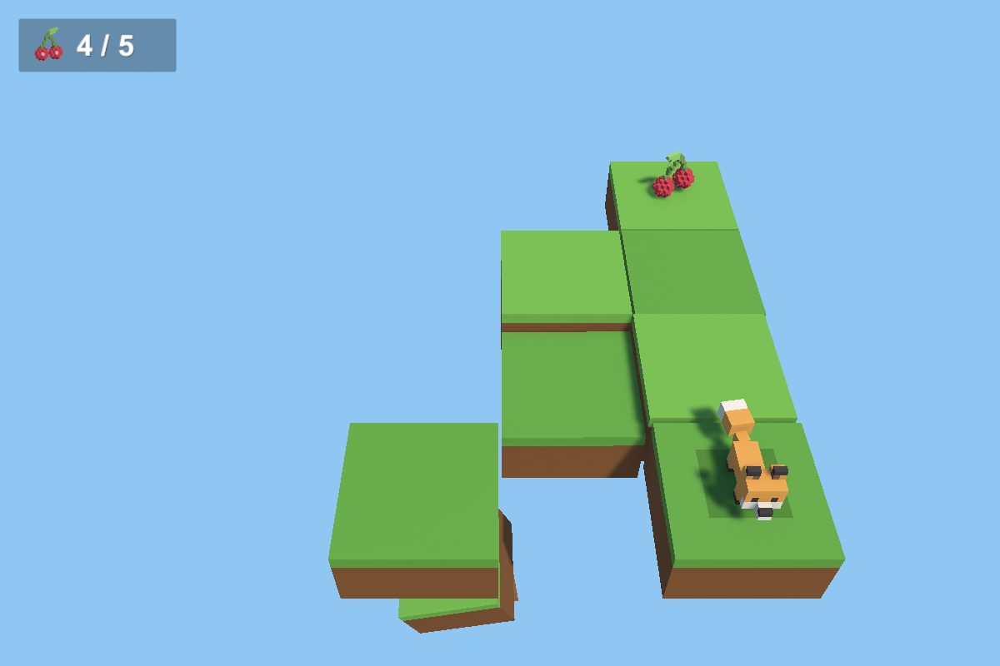
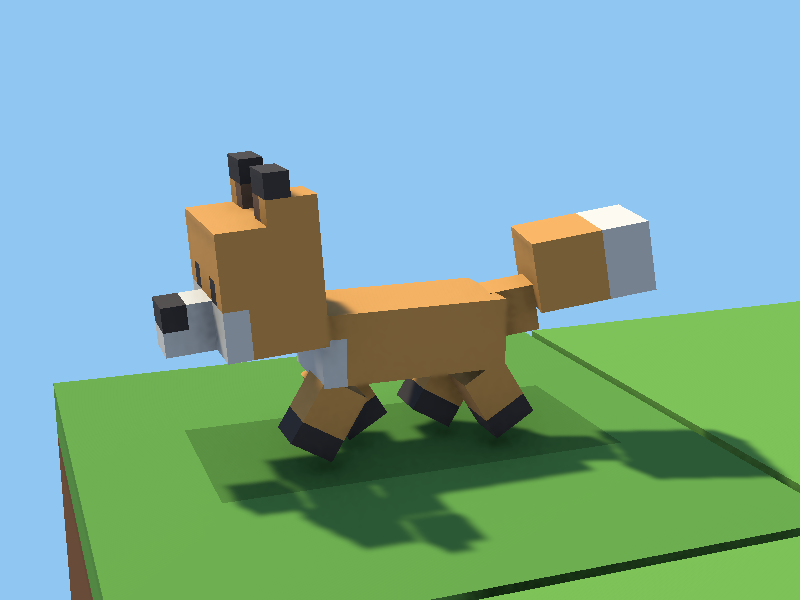
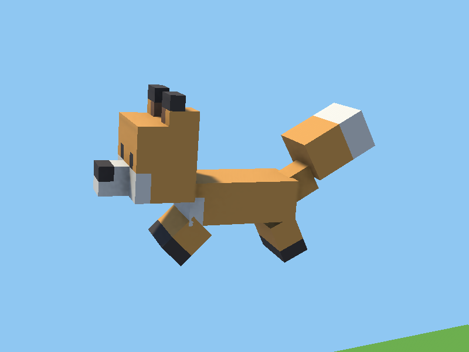
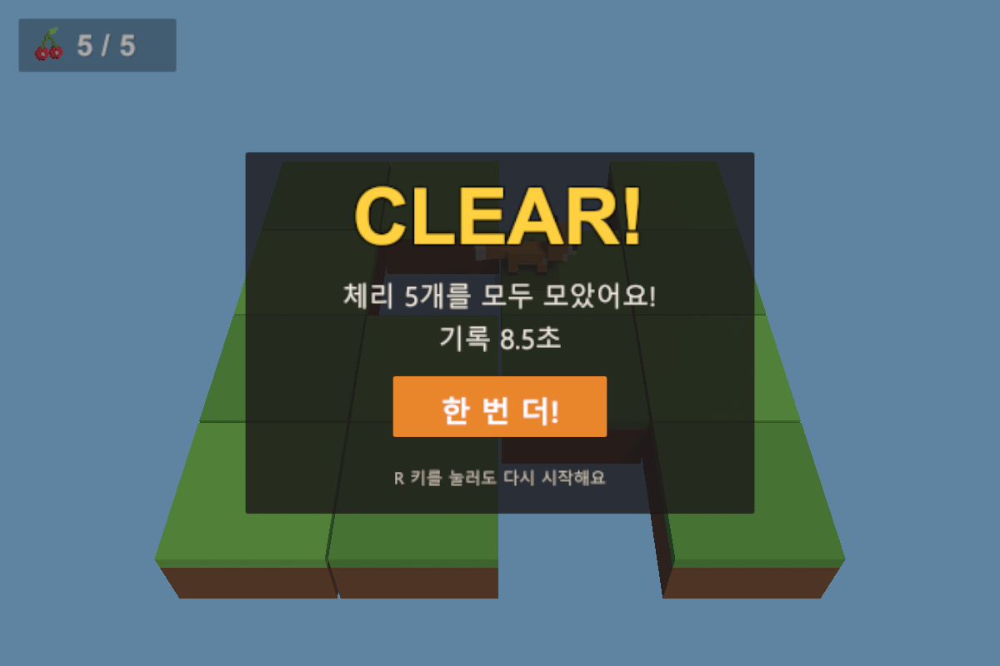
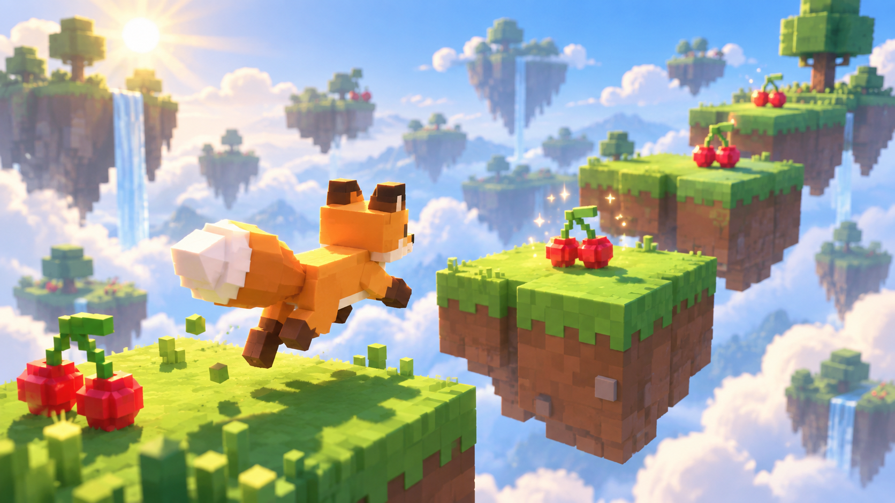

# 🦊 여우 복셀 3D 게임

Blender로 만든 복셀 여우가 4x4 타일맵을 뛰어다니며 체리 5개를 모으는 Unity 6 캐주얼 게임입니다.

### ▶ [브라우저에서 바로 하기](https://carttman.github.io/FoxGame/)

PC 브라우저(Chrome · Edge 등)에서 설치 없이 실행됩니다. 처음 불러올 때 약 13MB를 받습니다.



## 규칙

- 체리 5개를 모두 모으면 **CLEAR!**
- 구멍이나 맵 밖으로 떨어지면 **GAME OVER**
- 구멍 위 공중에 떠 있는 체리(빛기둥 표시)는 점프해야 먹을 수 있습니다
- **여우가 지나간 바닥은 흔들리다가 1초 뒤에 떨어집니다.** 한 번 지나간 길로는 돌아갈 수 없으니 순서를 생각하세요 (가만히 있거나 제자리 점프는 괜찮아요)



| 키 | 동작 |
|---|---|
| `W` `A` `S` `D` / 방향키 / 왼쪽 스틱 | 이동 |
| `Space` / 게임패드 A | 점프 |
| `R` / 게임패드 Start | 재시작 (언제든) |
| `Enter` / 클릭 | 결과 화면 [다시 하기] |

| 걷기 | 점프 | 결과 |
|---|---|---|
|  |  |  |

## 실행

웹: <https://carttman.github.io/FoxGame/>

Unity 에디터:

1. [Unity Hub](https://unity.com/download)에서 **Add** → `FoxGame` 폴더 선택 (Unity **6000.3.10f1**)
2. `Assets/Scenes/FoxGame.unity` 열기 → **Play**

## 구성

| 폴더 | 내용 |
|---|---|
| `Blender/` | 복셀 모델 생성 스크립트 (`make_fox.py`, `make_cherry.py`) 와 결과물(.blend / .fbx) |
| `FoxGame/Assets/Scripts/` | 게임 코드 — 이동·점프, 부위 회전 애니메이션, 아이템, 게임 상태, HUD, 결과 화면, 무너지는 바닥 |
| `FoxGame/Assets/Editor/` | 단계별 씬 셋업·검증 스크립트 (메뉴 **Tools > Fox**) |
| `FoxGame/Assets/Tests/PlayMode/` | Play 모드 테스트 (가상 키보드로 실제 게임 루프 확인) |
| `개발계획서.md` / `.html` | 단계별 개발 계획과 진행 기록 |
| `이슈기록.md` / `.html` | 개발 중 부딪힌 문제의 원인·해결·재발 방지 |
| `Art/` | Codex CLI가 그린 게임 그림 (키 아트, 아이콘). 화풍 가이드는 `AGENTS.md` |
| `Store/` | Microsoft Store MSIX 포장 스크립트와 패키지 설정 |

### 그림 그리기 (Codex CLI)

[Codex CLI](https://github.com/openai/codex)(`npm install -g @openai/codex`, 로그인 필요)가 `AGENTS.md`의 화풍 가이드를 따라 그림을 만들어 `Art/`에 저장합니다.

```bash
powershell -ExecutionPolicy Bypass -File Art/codex-draw.ps1 -Name title_bg -Prompt "타이틀 화면 배경: 여우가 체리 타일 위에서 손을 흔듦"
```

옵션: `-Ref`(참고 캡처, 기본 `FoxGame/Captures/step5_start.png`), `-Size`(비율, 기본 `16:9`)



### Microsoft Store용 Windows 패키지 (MSIX)

1. Unity 메뉴 **Tools > Fox > Windows 스토어 빌드** → `FoxGame/Builds/Windows/FoxGame.exe` (Codex가 그린 아이콘 포함)
2. 저장소 루트에서 아래 명령 → `FoxGame/Builds/Store/*.msix` (Windows SDK 필요)

```bash
powershell -ExecutionPolicy Bypass -File Store/make-msix.ps1
```

스토어에 올리기 전에 `Store/store-config.json`의 패키지 ID·게시자 값을 Partner Center의 **제품 ID** 값으로 바꿔야 합니다 (지금은 임시값).

### 모델 다시 만들기

```bash
blender -b -P Blender/make_fox.py
```

```bash
blender -b -P Blender/make_cherry.py
```

만들어진 `.fbx`를 `FoxGame/Assets/Models/`에 복사하면 Unity가 다시 가져옵니다.

## 검증

- **Tools > Fox > 전체 검증**: 편집 모드 시뮬레이션 27건 (이동, 점프, 애니메이션, 아이템, 게임 결과, 무너지는 바닥)
- **Window > General > Test Runner > PlayMode > Run All**: Play 모드 테스트 9건 (키 입력, 게임 오버, 재시작, 무너지는 바닥)

## 사용 도구

Unity 6 (URP, Input System) · Blender 5.2
